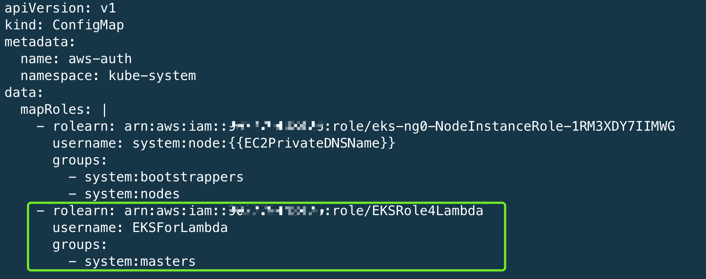
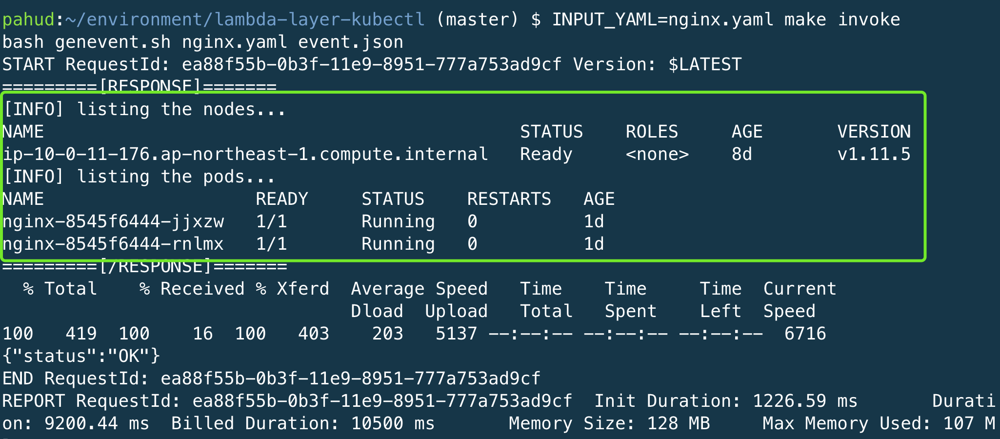
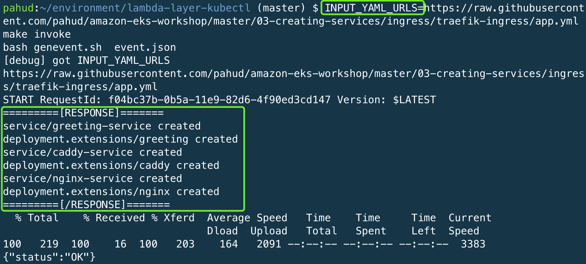

# lambda-layer-kubectl

**lambda-layer-kubectl** is an [AWS Lambda Layer](https://docs.aws.amazon.com/en_us/lambda/latest/dg/configuration-layers.html) that encapsulates all the required assets to interact with **Amazon EKS** control plane and help you directly **`kubectl`** against Amazon EKS in AWS Lambda. You could just write 2~5 lines of shell script and it takes all the rest for you while your code size could minimize down to [1.5KB only](https://twitter.com/pahudnet/status/1078563515898707968).


# Features

- [x] Ships all the required assests including `kubectl`, `aws-iam-authenticator` and `awe-cli`. Just include the layer and you get everything required.
- [x] It takes care of the Amazon EKS authentication behind the scene.
- [x] Straight `kubectl` against Amazon EKS without `client-go` or python client SDK for K8s. Zero code experience required. Just shell script.
- [x] Invoke your Lambda function with any `yaml` file from local and it can `kubectl apply -f` for you to apply it on Amazon EKS.


# HOWTO

You can just include the provided Lambda Layer from my account or built your own from scratch.


## Build from scratch

1. check out this repository 

```
$ curl -L -o lambda-layer-kubectl.zip https://github.com/pahud/lambda-layer-kubectl/archive/master.zip
$ unzip lambda-layer-kubectl.zip
$ cd lambda-layer-kubectl-master
```

or just 

```
$ git clone https://github.com/pahud/lambda-layer-kubectl.git
```

2. Download required binaries including `kubectl` and `aws-iam-authenticator` 


```
$ make download
```

(this may take a moment to complete the download)

3. edit the `Makefile`

| Name                 | Description                                                  | required to update |
| -------------------- | ------------------------------------------------------------ | ------------------ |
| **LAYER_NAME**       | Layer Name                                                   |                    |
| **LAYER_DESC**       | Layer Description                                            |                    |
| **INPUT_JSON**       | input json payload file for lambda invocation                |                    |
| **S3BUCKET**         | Your S3 bucket to store the intermediate Lambda bundle zip.<br />Make sure the S3 bucket in the same region with your Lambda function to deploy. | YES                |
| **LAMBDA_REGION**    | The region code to deploy your Lambda function               |                    |
| **LAMBDA_FUNC_NAME** | Lambda function name                                         |                    |
| **LAMBDA_ROLE_ARN**  | Lambda IAM role ARN                                          | YES                |


### Required Policy for Lambda IAM Role

Please note your IAM role for Lambda will need `eks:DescribeCluster` as well as other ec2 read-only privileges depending on what you intend to do in your Lambda function. You may attach an inline policy as below to your Lambda IAM role.

```
{
    "Version": "2012-10-17",
    "Statement": [
        {
            "Sid": "VisualEditor0",
            "Effect": "Allow",
            "Action": [
                "ec2:DescribeInstances",
                "ec2:DescribeTags",
                "eks:DescribeCluster"
            ],
            "Resource": "*"
        }
    ]
}
```


4. Build the Layer

```
$ make layer-all
```

This will bundle the layer and publish a version for this layer. You should see the return as below:

```
{
    "LayerVersionArn": "arn:aws:lambda:ap-northeast-1:xxxxxxxxxx:layer:eks-kubectl-layer:1", 
    "Description": "eks-kubectl-layer", 
    "CreatedDate": "2018-12-29T07:26:27.714+0000", 
    "LayerArn": "arn:aws:lambda:ap-northeast-1:xxxxxxxx:layer:eks-kubectl-layer", 
    "Content": {
        "CodeSize": 30058444, 
        "CodeSha256": "T5ayJCuQrTQ80zwtforJpglUV5vGr/Kwz48DJsu8Q4k=", 
        "Location": "..."
    }, 
    "Version": 1, 
    "CompatibleRuntimes": [
        "provided"
    ], 
    "LicenseInfo": "MIT"
}
```

OK. Now your layer is ready. Very simple, isn't it?  

Please copy the value of `LayerVersionArn` above.


5. create the lambda function

Build the function zip bundle for the function

```
$ make func-zip
```

Create the function with the layer ARN and default Amazon EKS cluster name(`cluster_name`) provided

```
$ LAMBDA_LAYERS=arn:aws:lambda:ap-northeast-1:xxxxxxxx:layer:eks-kubectl-layer:25 CLUSTER_NAME=eksnrt make create-func
```

response:

```
{
    "Layers": [
        {
            "CodeSize": 30058444, 
            "Arn": "arn:aws:lambda:ap-northeast-1:xxxxxxxx:layer:eks-kubectl-layer:25"
        }
    ], 
    "FunctionName": "eks-kubectl", 
    "LastModified": "2018-12-31T12:11:12.996+0000", 
    "RevisionId": "7550c7bf-b6d4-45f8-a95a-3e8801c9a185", 
    "MemorySize": 128, 
    "Environment": {
        "Variables": {
            "cluster_name": "eksnrt"
        }
    }, 
    "Version": "$LATEST", 
    "Role": "arn:aws:iam::xxxxxxxx:role/EKSLambdaRole", 
    "Timeout": 30, 
    "Runtime": "provided", 
    "TracingConfig": {
        "Mode": "PassThrough"
    }, 
    "CodeSha256": "hB9gOEy0U0kX9+hml0mpr4cT/nE8fXKSO3f2/RU0CCA=", 
    "Description": "demo func for lambda-layer-kubectl", 
    "CodeSize": 1802, 
    "FunctionArn": "arn:aws:lambda:ap-northeast-1:xxxxxxxx:function:eks-kubectl", 
    "Handler": "main"
}
```


6. Enable Lambda function to call Amazon EKS master API

Update the `aws-auth-cm.yaml` described in [Amazon EKS User Guide - getting started](https://docs.aws.amazon.com/en_us/eks/latest/userguide/getting-started.html). Add an extra `rolearn` section as below to allow your Lambda function map its role as `system:masters` in RBAC.




# Test and Validate

To `kubeclt get nodes`, `kubectl get pods` or `kubectl apply -f REMOTE_URL` just edit `main.sh`as below


```
#!/bin/bash
# pahud/lambda-layer-kubectl for Amazon EKS

# include the common-used shortcuts
source libs.sh

# with shortcuts(defined in libs.sh)
echo "[INFO] listing the nodes..."
get_nodes

echo "[INFO] listing the pods..."
get_pods

# or go straight with kubectl
echo "[INFO] listing the nodes..."
kubectl get no

echo "[INFO] listing the pods..."
kubectl get po

# to specify different ns
echo "[INFO] listing the pods..."
kubectl -n kube-system get po

# kubectl apply -f REMOTE_URL
kubectl apply -f http://SOME_REMOTE_URL

# kubectl delete -f REMOTE_URL
kubectl delete -f http://SOME_REMOTE_URL

exit 0
```

And publish your function again

```
$ make func-all
```

Invoke

```
$ INPUT_YAML=nginx.yaml make invoke
```

Response




To pass through the local `yaml` file to lambda and execute `kubectl apply -f`


```
#!/bin/bash
# pahud/lambda-layer-kubectl for Amazon EKS

# include the common-used shortcuts
source libs.sh

data=$(echo $1 | jq -r .data | base64 -d)

echo "$data" | kubectl apply -f - 2>&1

exit 0
```


Update the function

```
$ make func-all
```


Invoke

```
$ INPUT_YAML=nginx.yaml make invoke
```

Response


To specify different `cluster_name` with the default one in environment variable:

```
$ CLUSTER_NAME="another_cluster_name" INPUT_YAML=nginx.yaml make invoke
```
(see [#1](https://github.com/pahud/lambda-layer-kubectl/issues/1) for implementation details)


kubectl apply -f `REMOTE_URL` like this

```
$ INPUT_YAML_URLS="URL1 URL2 URL3" make invoke
```

e.g.




I hope you find it useful and have fun with this project! Issues and PRs are very appreciated.


# More Samples
check [samples](./samples) directory


# Todo

- [x] provide more samples
